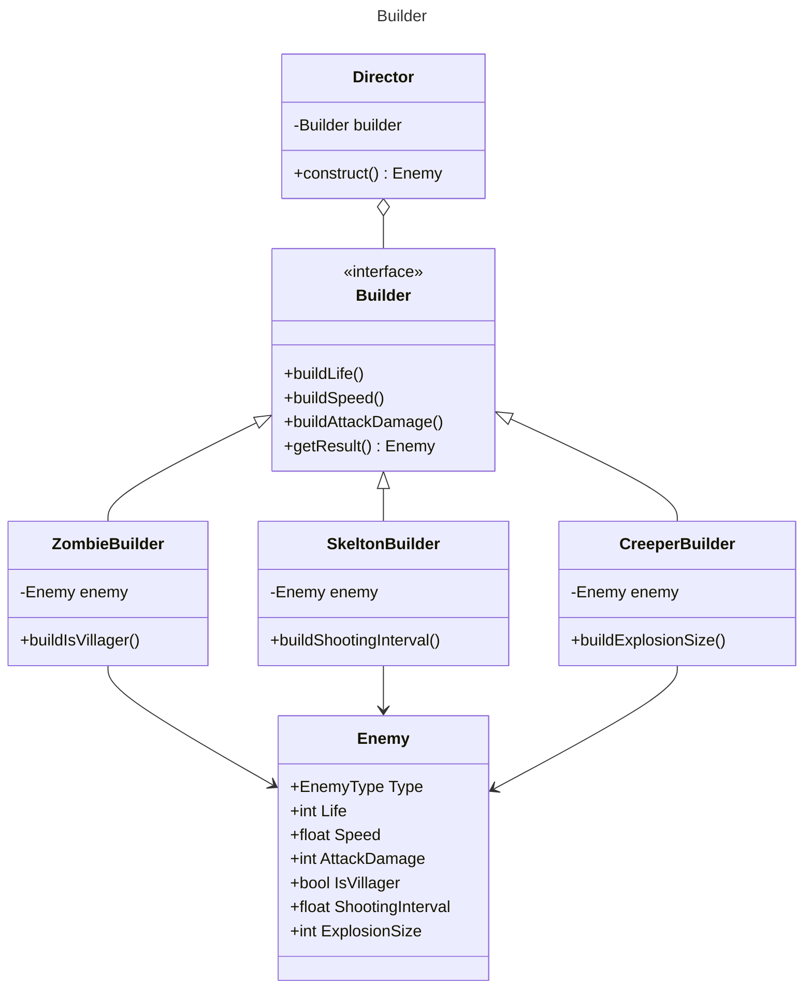

### 参考
- [Builder パターン](https://ja.wikipedia.org/wiki/Builder_%E3%83%91%E3%82%BF%E3%83%BC%E3%83%B3)
- [Builderパターン #リファクタリング](https://www.google.com/search?q=gof+builder&rlz=1C1JZAP_jaJP1004JP1004&oq=gof+builder&gs_lcrp=EgZjaHJvbWUqBwgAEAAYgAQyBwgAEAAYgAQyBggBEAAYHjIGCAIQABgeMggIAxAAGAgYHtIBCDQ0NjVqMGo3qAIAsAIA&sourceid=chrome&ie=UTF-8#:~:text=Builder%E3%83%91%E3%82%BF%E3%83%BC%E3%83%B3%20%23%E3%83%AA%E3%83%95%E3%82%A1%E3%82%AF%E3%82%BF%E3%83%AA%E3%83%B3%E3%82%B0)
- [GoF（Gang of Four）デザインパターン：ビルダ（Builder）](https://qiita.com/gts/items/399034e504cf5d660e43)
