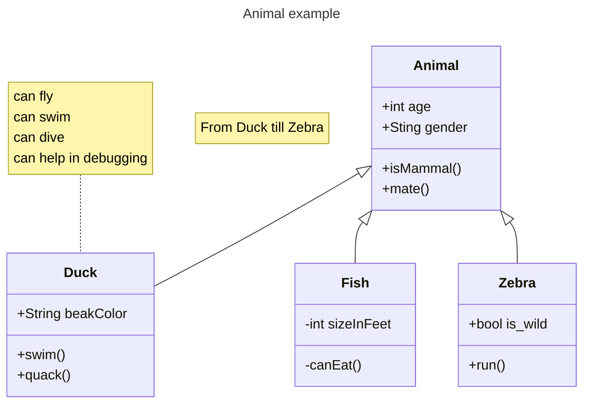

# Mermaid動作確認

:::mermaid
graph RL
    subgraph "仕様"
        A-1[Mermaid]
    end
    subgraph "実装"
        A-1 --> B-1["JavaScriptライブラリ(mermaid.js)"]
        A-1 --> B-2[CLI]
        A-1 --> B-3[プラグイン]
        A-1 --> B-4[Webサービス]
    end
    A-1[Mermaid] --> A-2[公式ドキュメント]
:::

# Mermaidバージョン

```mermaid
info
```

# クラス図 サンプル


